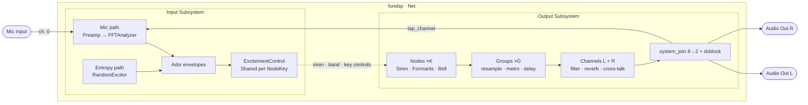
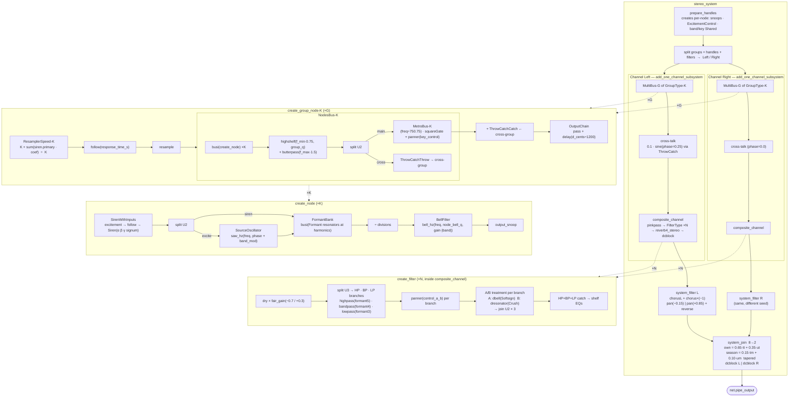
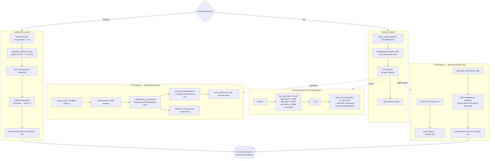

# Audio System — `system` Module

> Architecture outline and signal-flow reference.

---

## Overview

The `system` module is the top-level wiring layer.  It constructs two independent but
interconnected sub-graphs inside a single `fundsp::Net`:

| Sub-graph | Entry point | Purpose |
|-----------|-------------|---------|
| **Output** | `create_output_system` | Synthesises audio from instrument config |
| **Input** | `create_input_system` | Analyses mic audio _or_ generates random excitement that drives the output |

Both are inserted into the **same `Net`** at call-site.  The input sub-graph feeds the output
sub-graph through `ExcitementControl` shared values — there is no direct audio path from
input to output.

---

## Wiring Diagrams

### System Overview



---

### Output Signal Flow



---

### Input Signal Flow



---

## Entry Points

```rust
// system.rs
pub fn create_output_system<S>(config: &instrument::Config, net: &mut Net, num_channels: usize, …)
    -> Vec<NodeHandles>

pub fn create_input_system<S>(config: &tuner::Config, net: &mut Net,
    excitements: HashMap<NodeKey, ExcitementControl>, source: ExcitementSource, …)
    -> Vec<SensorHandles>
```

Typical call-site sequence (see `tests.rs`):

1. Create `Net::new(1 input, N outputs)`.
2. Call `create_output_system` → get `Vec<NodeHandles>`.
3. Collect `NodeHandles::siren_control` into an `excitements` map.
4. Call `create_input_system` with that map.

---

## Shared Control Primitives

### `ExcitementControl`  (`excitement_control.rs`)

A pair of `fundsp::Shared` values carrying a complex number `(re, im)`:

| Field | Role |
|-------|------|
| `primary` (`re`) | Main amplitude / excitement level |
| `secondary` (`im`) | Modulation depth / secondary colour |

Methods: `set_value((re, im))`, `value::<S>() -> Complex<S>`, `reset()`.

Used everywhere that one sub-graph needs to steer another without an audio connection.

---

### `FineTunedValues` / `FineTunedSharedValues`  (`values.rs`)

A bundle of 13 DSP constants (Q factors, gains, follow times, etc.) that are either:

* **`Constant<U1>`** (production, `#[cfg(not(feature = "editor"))]`) — baked in at build time.
* **`Var`** (editor, `#[cfg(feature = "editor")]`) — backed by `FineTunedSharedValues` and
  live-tweakable at runtime.

| Parameter | Default | Purpose |
|-----------|---------|---------|
| `siren_alpha` | 100/7.5 | Siren full-period scaling |
| `node_bell_q` | 1.7 | Bell EQ Q per node |
| `node_bell_gain_db` | 2.9 dB | Bell EQ gain per node |
| `node_follow_response_time_s` | 7.5 ms | Envelope follower time |
| `group_q` | 2.737 | Group high-shelf Q |
| `group_ls_gain_db` | 1.8 dB | Group shelf gain |
| `formant_base_q` | 3.7 | Base Q for formant resonators |
| `filter_morph_follow_s` | 50 ms | Filter morph follow time |
| `filter_q_piercing` | 1.3 | HP branch Q |
| `filter_q_bright` | 1.4 | BP branch Q |
| `filter_q_shelf` | 3.996 | Catch-shelf Q |
| `filter_shelf_gain_db` | 3.8 dB | Catch-shelf gain |
| `filter_q_warm` | 8.095 | LP branch Q |

---

## Output System

### Routing by channel count

```
create_output_system
  ├─ 1  → mono_system
  ├─ 2  → stereo_system
  └─ 3+ → multi_channel_system  (delegates to stereo_system)
```

### Handle preparation  (`output.rs :: prepare_handles`)

Before any DSP nodes are built, `prepare_handles` iterates every `GroupConfig → NodeConfig` and
creates **per-node** objects:

| Object | Type | Shared with |
|--------|------|-------------|
| `excitement_snoop` front/back | `Snoop` / `SnoopBackend` | `NodeHandles` / inner net |
| `secondary_excitement_snoop` | same | same |
| `output_snoop` | same | same |
| `siren_control` | `ExcitementControl` | `NodeHandles`, input system |
| `band_control` | `Shared` | node, metro, filter |
| `key_control` | `Shared` | metro, filter |
| `siren_signum` | `Constant<U1>` | node (`Scale::Yo` → -1, `Scale::In` → +1) |

Returns `(Vec<NodeHandles>, Vec<HashMap<NodeKey, InnerHandles>>, Vec<FilterHandles>)`.

---

### Stereo System  (`output::stereo_system`)

```
prepare_handles
     │
     ├─ split_groups_lr / split_group_handles_lr / split_filter_handles_lr
     │         (assigns groups to Left / Right by GroupChannel)
     │
     ├── add_one_channel_subsystem (Left)   ──throw_l──►──catch_l──┐
     └── add_one_channel_subsystem (Right)  ──throw_r──►──catch_r──┘
              │                                                     │
          system_filter L                                      system_filter R
          (chorus + anti-phase chorus * -1)                    (same, different seed)
          pan(-0.15) / pan(0.85)                               reversed
              │                                                     │
              └──────────────── system_join (8→2) ─────────────────┘
                     cross-blend mapper:
                       own   = 0.65·treated + 0.35·untreated
                       season = 0.15·tm_opp + 0.10·um_opp, tapered by own.abs()
                       output = own + season
              │
          dcblock_hz (L) | dcblock_hz (R)
              │
          net.pipe_output
```

Cross-channel signal labels used inside the join mapper:

| Label | Meaning |
|-------|---------|
| `tt^` | Treated (chorus) from own channel |
| `ut^` | Untreated (dry) from own channel |
| `tm`  | Treated mixin from opposite channel |
| `um`  | Untreated mixin from opposite channel |

---

### Channel Subsystem  (`output/channel.rs :: add_one_channel_subsystem`)

```
add_channel_system<G, K>          (MultiBus of G groups, K nodes each)
     │
  cross-talk node
     ├─ split::<U2>()
     ├─ pass  (main signal)
     ├─ catch_x * (0.1 → sine, phase-shifted by channel) * 0.1
     └─ throw_x  (feeds opposite channel's catch)
     │
add_channel_filter<F>             (one FilterType per node)
     │
  band_controls_value              (sum of band_controls / F)
  ab_controls_value                (sum of key_controls / F)
  panner_node                      (panner steered by band+ab)
  filter_channel                   (pinkpass → pipei of FilterType → sum)
  composite_channel:
     panner_node
     >> (filter_channel | pass)
     >> reverb4_stereo(17.5, …)
     >> dcblock
```

---

### Group Node  (`output/group.rs :: create_group_node`)

```
ReamplerSpeed<K>
  ┌─ constant(K)
  ├─ pipei<K>: pass + (var(siren_control.primary) * coef)
  └─ (pass + bands_sum) / K
        bands_sum = Σ (1 - band_control_k * 2) * -coef
     │
     ▼
ProductionChain
  follow(node_follow_response_time_s)   ← smoothed resampler speed
     │
  resample ──────────────────────────────────────────────────────┐
     │                                                           │
   NodesBus<K>                                                   │
     busi<K>(create_node)         K individual nodes              │
     >> highshelf(f_min*0.75, group_q, group_ls_gain_db)         │
     >> butterpass(f_max*1.5)                                     │
     >> split::<U2>()                                             │
     >> (pass | ThrowCatchThrow)   ──► cross-group send          │
     >> MetroBus<K>                  rhythm + panning             │
                                                                  │
  + ThrowCatchCatch ◄─────────────────────────────────────────────┘
     │
OutputChain
  (pass | delay(group_delay_cents/1200))
  >> (pass + pass)
```

`coef = (1/K)^(group_idx+2) / K` — lower groups move faster; higher groups are increasingly
damped.

---

### Individual Node  (`output/node.rs :: create_node`)

```
SirenWithInputs
  excitement follow ──► siren_excitement (SnoopBackend-tapped)
  siren_modulated_alpha = siren_alpha / (1 + |band_control| * siren_alpha)
  siren_phase_at(config.phase, config.divisions, config.cents)
     │
     ▼  Siren<S>   (5-input custom AudioNode)
        inputs: excitement, alpha, beta, gamma, signum
        shape: (e^{-t/βα} - e^{-t/γα}) · cos²(πt/α) · sign
        wraps at α(1+β+γ), flips sign each cycle
     │
  split::<U2>()
     │           │
SourceOscillator  pass (excitement)
  (saw_hz + phase + band_control modulation)
     │           │
(FormantBank * pass)
  busi of Formant resonators at harmonics 1..N
  Formant: resonator at base_freq + (base_freq * control/index), Q = base_q + control*base_q
     │
  mul(1 / divisions)
     │
  BellFilter
  bell_hz(config.frequency, node_bell_q, node_bell_gain_db * |band_control|)
     │
  output_snoop  (SnoopBackend)
```

---

### Metro  (`output/metro.rs :: create_metro`)

Per-node rhythmic modulator:

```
controlled_freq = (node_freq / 750.75) * (1.1 - band_control)

metro_mod:
  (controlled_freq / divisions) * (index+1)
  >> square() - 1.0
  >> abs()                         ← 0..1 amplitude gate

pan_control = clip(-0.7, 1.0)(1.0 - key_control * 2.0)

output:
  (pass | pan_control) >> panner
  >> (pass * metro_mod) + pass     ← rhythmically gate the panned signal, add dry
```

`MetroBus<K>` is a `MultiBus<K, MetroType>` scaled by `1/K`.

---

### ThrowCatch  (`output/throw_catch.rs`)

A pair of `AudioNode` wrappers around a shared `Arc<ThingBuf<f32>>`:

* `ThrowCatchThrow` — 1 input, 0 outputs: pushes to ring buffer.
* `ThrowCatchCatch` — 0 inputs, 1 output: pops from ring buffer (returns 0.0 on underrun).

Used for: cross-group routing inside a group, cross-channel routing between L/R, and
intra-filter HP/BP/LP branch routing.

---

### Filter  (`output/filter.rs :: create_filter`)

Complex A/B morphing filter per node, driven by `control` (band_control) and `control_a_b`
(key_control):

```
multipass::<U2>()
  >> (pass * fair_gain(-0.7)) | (pass * fair_gain(0.3))   ← dry splits with relative gain
  >> wet_chain | pass
       wet_chain:
         split::<U3>()
         >> FreqBranches:
              hp_branch  (highpass at formant_hz(5), Q=piercing)
              bp_branch  (bandpass at formant_hz(4), Q=bright)
              lp_branch  (lowpass at formant_hz(3), Q=warm)
              multisplit::<U3, U2>()
              throw HP/BP/LP to inner ThrowCatchThrow
         >> PannerBranches (panner steered by control_a_b for each branch)
         >> AbTreatment (A/B per branch):
              a_hp: dbell(Softsign(shape))
              b_hp: dresonator(Crush(shape)) * fair_gain(-0.2)
              a_bp: dbell(Softsign(shape))
              b_bp: fresonator(SoftCrush(shape)) * fair_gain(0.1)
              a_lp: dbell(Softsign(shape))
              b_lp: dresonator(SoftCrush(shape)) * fair_gain(-0.1)
         >> join::<U2>() * 3   (L+R for each branch)
  >> pass | (pass + freq_catch)
       freq_catch = (hp_catch + bp_catch + lp_catch)
                   >> (pass | q_shelf | fair_gain(-0.3))
                   >> (highshelf | highshelf | lowshelf)
  >> multipass::<U2>()
```

`shape = clamp(1200/(cents + ε), ε, 1)` — narrow-interval nodes get softer curves.
`fair_gain(v) = |0.5*(v + control_a_b) * (1 - secondary_xct*2)| * gain`

---

## Input System

### Routing by source

```
create_input_system
  ├─ ExcitementSource::Mic     → input::sensors_system    (FFT analysis)
  └─ ExcitementSource::Entropy → input::randomized_system (random envelopes)
```

---

### Mic Path  (`input.rs :: sensors_system`)

```
Net input (channel 0)
  │
  [optional: input_snoop SnoopBackend]
  │
  input_id  (stacki of sensor Shared vars + min_freq + max_freq)
  │  inputs: [0]=audio  [1..1+4N)=sensor params  [1+4N..+2)=min/max freq
  │
  analyzer_id  FFTAnalyzer<S>
  │  wraps: PreampType (dcblock → bell EQ cascade → NewYork compressor)
  │  side-effect: writes ExcitementControl shared values per key
  │
  net.connect_output(analyzer_id, 0, tap_channel)
     ↑ taps output channel `tap_channel` back into the FFT input window
```

`SensorHandles` returned: per-sensor `Shared` for `min_frequency`, `max_frequency`,
`min_magnitude`, `max_magnitude`.

---

### Preamp  (`input/preamp.rs`)

```
dcblock
  >> bus of 4 bell EQs + pass (dry)
       20 Hz   / Q=1.5 / -2.7 dB
       100 Hz  / Q=1.8 / +0.7 dB
       1 kHz   / Q=2.0 / +0.5 dB
       10 kHz  / Q=2.0 / +3.5 dB
  >> mul(0.5)
  >> (pass | ny_threshold | ny_wet_ratio)
  >> NewYork compressor
```

Calibration targets a flat perceived response across the mic capture range.

---

### NewYork Compressor  (`input/new_york.rs`)

Parallel ("New York") compressor — 3 inputs: `audio`, `threshold`, `wet_mix`.

```
wet = soft_compress(dry, threshold)
  where soft_compress:
    nd = |a - t| / (a + t)          (normalised distance from knee)
    y0 = a * (1 + nd*t) / (1 + nd*a)
    corr = (t - a) / (a + t)
    y  = y0 + (t - y0) * corr * nd²

output = dry * (1 - wet_mix) + wet * wet_mix
```

---

### FFT Analyzer  (`input/analyzer.rs`)

Custom `AudioUnit` (1 input, 1 output):

**Audio thread (`tick` / `process`)**:
1. Run inner preamp net on audio input.
2. Push samples into `window_thb` ring buffer.
3. Read `next_excitements_abs` (RwLock read) → feed each key's `Adsr` → update
   `ExcitementControl` shared values.
4. Forward one sample to the output (tap channel).

**Background thread (spawned in `init_handle`)**:
1. Drain `window_thb` → accumulate `FFT_WINDOW_SIZE` (8192) samples.
2. Apply Hann window.
3. `samples_fft_to_spectrum` with configured `FrequencyLimit`.
4. Per-sensor: find peak in `[min_freq, max_freq]`, compute magnitude.
5. Write `HashMap<NodeKey, Complex<S>>` into `next_excitements_abs` (RwLock write).
6. Push spectrum arc to `spectrum_thb` for external consumers.

`FFT_WINDOW_SIZE = 8192` — good balance of frequency resolution vs. latency.

---

### ADSR Envelope  (`input/adsr.rs`)

Used by both `FFTAnalyzer` and `RandomExcitor`.  No fixed time constants — all phase durations
are computed from *distances* and *meta pressure*:

```
meta  = clamp(delta - current_delta, -1, 1)   ("new demand" minus "current debt")

attack_steps  = distance_up   * meta.max(0)  * sample_rate
decay_steps   = distance_down * (-meta).max(0) * sample_rate
release_steps = distance_to_zero * (-meta).max(0) * sample_rate
sustain_steps = ∞  (when meta ≈ 0 and target ≈ current)

shape = clamp(|0.5 + meta * delta_im|, 0, 1)
        (decay target = attack_target * shape)
```

Phases: `Idle → Attack → Decay → Sustain → Release → Idle`.  
Phase transitions are re-vectored on every `update()` call based on current pressure.

---

### Random Excitor  (`input/random_excitor.rs`)

Custom `AudioUnit` (1 input unused, 0 outputs) for `ExcitementSource::Entropy`:

```
per key:
  generate_random_target(key):
    r1, r2, r3 = fastrand f64
    avg = (r1+r2+r3)/3
    duration = avg^DURATION_POWER * MAX_DURATION_BASE_S  clamped [0.1, 17.5] s
    re = avg.sqrt | r2^3 | r3^5 | 0  (chosen by key.idx % 3,5 table)
    im = choice([avg^3, r1, r2, r3, avg])

  envelopes: HashMap<NodeKey, (Adsr<S>, Complex<S>)>
  remaining_frames: count-down to next target refresh

silence hysteresis:
  if all keys silent for SILENCE_HYST_FRAMES (64) consecutive frames
  → shorten remaining_frames / 3 to break silence faster
```

Constants: `MAX_DURATION_BASE_S = 17.5`, `MIN_HOLD_SECS = 0.1`, `DURATION_POWER = 3.0`,
`SILENCE_THRESH = 1e-9`, `SILENCE_HYST_FRAMES = 64`.

---

## Tests  (`tests.rs`)

| Test | Net layout | Source | Output |
|------|-----------|--------|--------|
| `instrument_with_rand_src` | `Net(1, 2)` | `ExcitementSource::Entropy` | SVG + WAV snapshots for all `layout_test_cases()` |
| `instrument_with_mic_src`  | `Net(1, 3)` | `ExcitementSource::Mic` | SVG snapshot with simulated random mic noise |

The third output channel (`tap_channel = 2`) in the mic test is used by `FFTAnalyzer` to tap
a copy of the synthesised output back into its spectrum analysis window.

Snapshot files live in `snapshots/` and are named `{width}x{height}_{Scale:?}`.